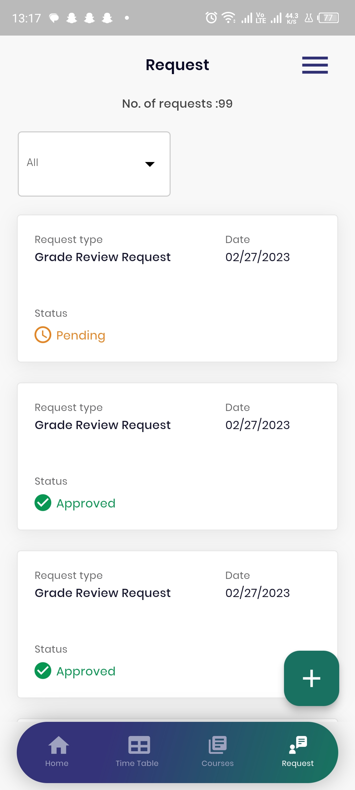

# University-SIS

 

INTRODUCTION

Knowledge international university is a charity based university operating in saudi arabic.
The KIU mobile app project is a suite of five applications designed for use by students, faculty, finance staff, executives, and sponsors at a university. The project is intended to streamline university operations, improve communication, and enhance the overall experience for all stakeholders. The Student app provides students with easy access to their course schedules, grades, assignments, and communication tools. The Faculty app allows professors to manage their courses and communicate with students. The Finance app helps finance staff manage university finances and student accounts. The Executive app provides university executives with access to real-time data and analytics to make informed decisions. The Sponsor app allows sponsors to support and engage with students and the university community. Together, the KIU mobile app project is a comprehensive solution that offers a unified and streamlined approach to university management and communication.

SYSTEM FEATURES
KIU is a complete system of 7 portals, which are pointed as follows
1. Student Portal
2. Faculty Portal
3. Finance Portal
4. Admin Portal
5. Sponsor Portal
6. Executive Portal
7. Admission Portals

Only two portal in these has mobile applications such as

Student Portal
1. Login
2. Timetable
3. Course Registration
4. Grades View
5. Courses View
6. Assignment Upload
7. Grade Review Request

Faculty Portal
1. Login
2. Courses
3. Reports

SYSTEM SCREENSHOTS

1. STUDENT PORTAL

        
      

2. FACULTY PORTAL

       

                                                              THANKS
